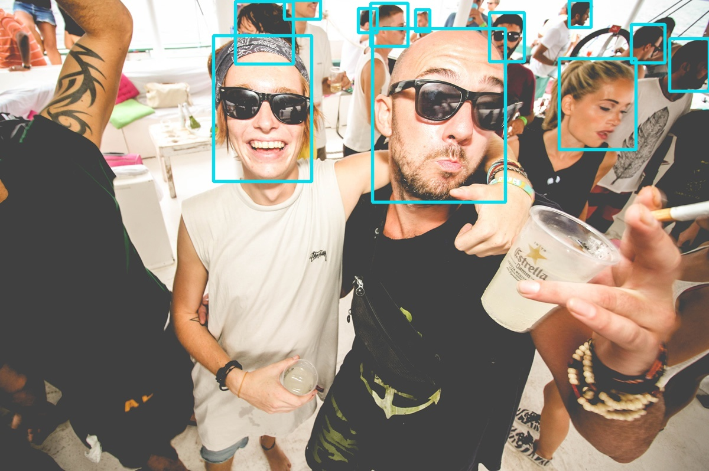

# Head-Detection-Yolov8
This repo provides a YOLOv8 model, finely trained for detecting human heads in complex crowd scenes, with the CrowdHuman dataset serving as training data. To boost accessibility and compatibility, I've reconstructed the labels in the CrowdHuman dataset, removing useless annotations, refining its annotations to perfectly match the YOLO format. 

# Detection Example

# CrowdDataset Dataset&Yolo Format
Download the CrowdDataset from [https://www.crowdhuman.org/download.html]. I have provided the YOLO format labels in the `CrowdHumanHead/labels.zip` file. Simply unzip this file and place the contents in the `CrowdHumanHead/labels` directory.

# Pre-trained YoloV8 Head Detection Model
Please download the model weight from this [Google Drive URL](https://drive.google.com/file/d/1qlBmiEU4GBV13fxPhLZqjhjBbREvs8-m/view?usp=sharing). 

# Model Inference 
`
python3 pred_yolo_v8.py
`

# Model Training 
`
python3 train_yolo_v8.py
`

# Some Useful Scrip as References
`Scrip/create_chuman.py` -- Creat txt format labels from ODGT.
`Scrip/gen_labels.py` -- Generate YOLO labels from txt format.
`Scrip/vis_labels.py`-- Visualize YOLO labels for label checking.

